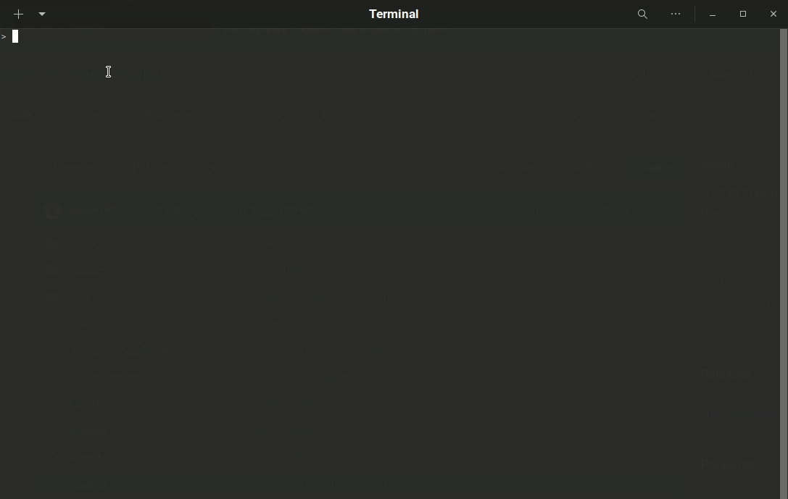

# wordle-helper

A script to help me solve the Wordle puzzles



## Usage

Clone this repo, run `wordle.py` in the terminal and follow the instructions in the script.

## Development

On Linux, run the below command:

```
make install
```

And it will set up a virtual environment with all of the installed dependencies. Ensure that `python` is version 3 (check using `python --version`).
